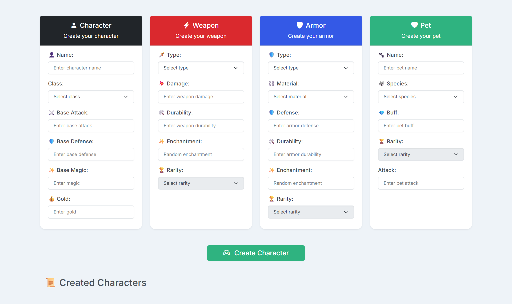
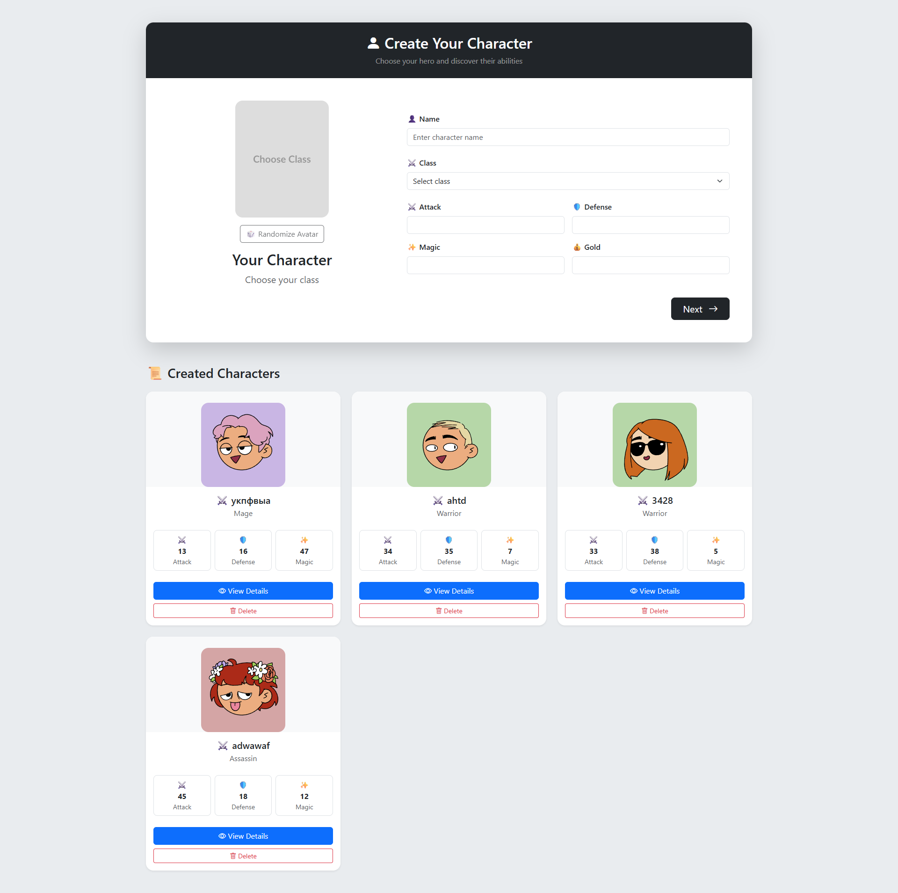
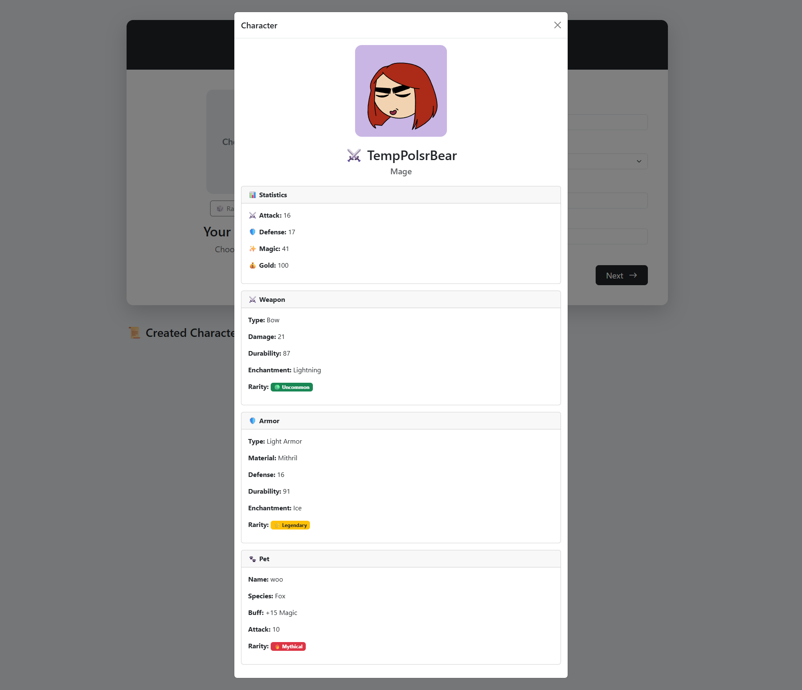

# Elation — Fantasy RPG Project

> **An assignment became a project.**

Elation is a personal fantasy RPG project that began as a JavaScript Character Creator assignment. The original exercise gave me a starting point, but the idea was interesting enough to continue developing independently.

The project is growing together with my skills: from a small creator interface into a foundation for a larger fantasy RPG experience.

---

## 🌱 Elation Beta — The Beginning

Elation Beta was the very first version of the project. It started as a Character Creator created while I was learning JavaScript.

In that first version, I practised:

- JavaScript
- DOM manipulation
- event listeners
- classes and object-oriented programming
- `localStorage`
- interface development

That first learning version became the starting point for everything that followed.



**The original Elation Beta — where the project began.**

---

## ⚔️ Elation v0.1

Elation v0.1 is the first version that continued as an independent personal project rather than only as a course assignment.

It includes the Character Creator and a Character Details modal as two views of the same version:



**Elation v0.1 — Character Creator**



**Elation v0.1 — Character Details**

---

### From Assignment to Personal Project

Elation started as a JavaScript course assignment, but the Character Creator idea was interesting enough for me to keep developing it independently. Over time, the project became a place to apply new knowledge, experiment, improve the existing architecture, and learn modern frontend technologies.

The original Character Creator is still the foundation, but Elation is no longer just a homework task. It is a personal project that develops alongside my skills.

---

## 🏗️ Current Status

The original Vanilla JavaScript Character Creator has been gradually migrated to TypeScript and React. React is now the main UI architecture of the project, and [`src/main.tsx`](src/main.tsx) is the application entry point.

The current project uses:

- Vite
- React
- TypeScript
- Bootstrap and CSS
- `localStorage`

The current foundation focuses on the Character Creator experience, character data, equipment, pets, details views, and saving characters in the browser.

### Current functionality

- Character creation flow
- Character, weapon, armour, and pet data
- Character list and details modal
- Validation feedback
- Browser persistence through `localStorage`

These are the current project capabilities. Future ideas are listed separately below.

---

## 📚 Learning & Development

Elation develops in parallel with my learning. I am currently continuing to study:

- TypeScript
- React
- React Query
- routing
- Next.js
- other modern frontend technologies

Learning Next.js does not mean that Elation is currently being moved from Vite to Next.js. The project's current stack remains **Vite + React + TypeScript**. Next.js is part of my learning process and may become a future direction if the project eventually needs that kind of architecture.

---

## 🧭 Development Philosophy

Elation is developed gradually. I do not want to implement everything at once.

My approach is simple: learn a technology, understand the concept, apply it to the project, and then move forward. The project grows together with my skills instead of trying to jump straight to a finished RPG.

Codex is used as a development tool, while the goal remains to understand the architecture, code, and technical decisions behind the project step by step.

---

## 🚀 Future Direction

The following are future ideas, not promises of current functionality:

- expanded character creation
- races and appearance customisation
- deeper equipment systems
- stats, buffs, and debuffs
- RPG mechanics
- world and story systems
- future backend systems
- possible Node.js development
- continued technical and creative development

The project will evolve according to what I learn and what the project actually needs.

---

## 🎮 Long-term Vision

The long-term vision is to transform the original Character Creator into a larger fantasy RPG experience.

The direction is intentionally gradual:

**small Character Creator → strong foundation → larger fantasy RPG project**

There are no fixed promises about implementation or timing. The important part is continuing to build, learn, and improve the project one step at a time.

---

## 🛠️ Tech Stack

- TypeScript
- React
- Vite
- Bootstrap
- CSS
- `localStorage`
- Git / GitHub

---

## 📁 Project Structure

```text
src/
├── App.tsx
├── main.tsx
├── components/
├── style.css
└── ts/
    ├── classes/
    ├── data/
    ├── types/
    └── utils/

docs/
└── img/

index.html
package.json
AGENTS.md
README.md
README_UA.md
```
